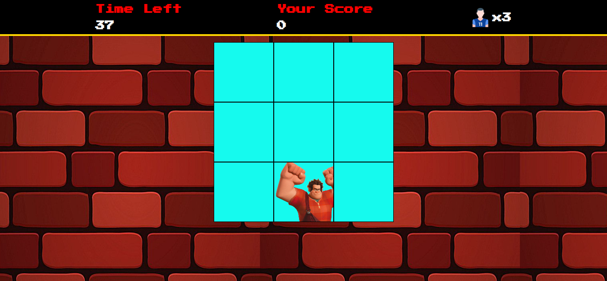

# 🖼️ Sobre o Projeto

## 🧱 Jogo Detona Ralph

Bem-vindo ao **Jogo Detona Ralph**, uma recriação inspirada no personagem da Disney!   
 Criado com **JavaScript**, **HTML5** e **CSS3**, totalmente funcional no navegador!  

---

## 🖼️ Preview

  

---

## 🚀 Tecnologias Utilizadas

---

## 🕹️ Funcionalidades

- 🧱 Ralph aparece aleatoriamente nos prédios 
- ⏰ Tempo limite para acertar os blocos 
- 👆 Jogue clicando nos quadrados certos 
- 🎯 Pontuação automática baseada no desempenho 
- 📱 Interface simples e responsiva 

---

## 📌 Status do Projeto

🟢 Concluído, mas sempre aberto a melhorias! 
Contribuições são bem-vindas. 😊 

---

## 👨‍💻 Autor
Feito com 💥 por [Samira]

